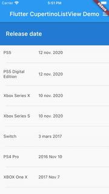

# cupertino_listview - Display a vertical list of sections (group of items), respecting iOS UX design.
This library tends to be the equivalent of iOS UITableView with plain sections.

It contains one widget: CupertinoListView, that mimics in its usage the [ListView] widget.


Therefore ou have two ways to build it:
- "dynamic" build of children, using [CupertinoListView.builder].
- "static" children, using [CupertinoListView] constructor.

### Examples
```dart
CupertinoListView.builder(
    sectionCount: _data.length,
    itemInSectionCount: (section) => _data[section].items.length,
    sectionBuilder: (context, sectionPath, _) => Text(_data[sectionPath.section].name),
    childBuilder: (context, indexPath) => Text(_data[indexPath.section].items[indexPath.child]),
    separatorBuilder: (context, indexPath) => Divider(indent: 20.0),
    controller: _scrollController,
);
```

```dart
CupertinoListView(
    children: _data.fold([], (list, section) {
        return [
          Text(_data[section].name),
          ..._data[section].items.map((item) => Text(item)).toList(),
        ];
    }),
    padding: const EdgeInsets.all(4.0),
);
```

### another example
You can also use this library in combination to scroll_to_index.

The complete explanation is available here:
https://medium.com/flutter-community/flutter-ios-styled-listview-cc21d8574dd5





### CupertinoListView properties

| Parameter            | Description                                                                                                                                           | Default value  |
| -------------------- |-------------------------------------------------------------------------------------------------------------------------------------------------------| -------------- |
| children             | List of sections. A section is a list with the section title as its first element, followed by section's items. Sections can be empty.                | -                       |
| floatingSectionBuilder | Required builder used to create floating section widget. This builder is intended to differentiate the section widget from list and the floating one. | -                       | 
| sectionCount         | Number of sections.                                                                                                                                   | -                       |
| itemInSectionCount   | Retrieve the number of items of sections.                                                                                                             | -                       |
| sectionBuilder       | Used to build the section title.                                                                                                                      | -                       |
| childBuilder         | Used to build an item of a section.                                                                                                                   | -                       |
| separatorBuilder     | Used to build separator between two children of sections.                                                                                             | -                       |
| controller           | Control the position to which this scroll view is scrolled.                                                                                           | -                       |
| cacheExtent          | Cache elements used to display faster and smoother the list.                                                                                          | -                       |
| clipBehavior         | Same as [ListView].clipBehavior: "ways to clip a widget's content".                                                                                   | Clip.hardEdge |
| dragStartBehavior    | Same as [ListView].dragStartBehavior: "Determines the way that drag start behavior is handled".                                                       | DragStartBehavior.start |
| physics              | Same as [ListView].physics: "How the scroll view should respond to user input".                                                                       | -                       |
| restorationId        | Same as [ListView].restorationId: used "to save and restore the scroll offset of the scrollable".                                                     | -                       |
| padding              | The amount of space by which to inset the children.                                                                                                   | -                       |
| keyboardDismissBehavior | Defines how the list will dismiss the keyboard automatically.                                                                                         | manual |
