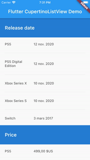

# cupertino_listview - Display a vertical list, iOS UX styled.
This library tends to be the equivalent of iOS UITableView with plain sections, where the current section title remains on top, and pushed away by the next section title.

It contains one widget: CupertinoListView, that mimics in its usage the [ListView] widget.



Therefore ou have two ways to build it:
- "dynamic" build of children, using [CupertinoListView.builder].
- "static" children, using [CupertinoListView] constructor.

```dart
CupertinoListView.builder(
    sectionCount: _data.length,
    itemInSectionCount: (section) => _data[section].itemCount,
    sectionBuilder: (context, section, _) => Text(_data[section].name),
    childBuilder: (context, section, index, _) => Text(_data[section].items[index]),
    separatorBuilder: (_, __, ___, ____) => Divider(indent: 20.0, endIndent: 20.0),
    controller: _scrollController,
);
```

```dart
CupertinoListView(
    children: _data.fold([], (list, section) {
        return [_data[section].name,  ..._data[section].items];
    }),
    padding: const EdgeInsets.all(4.0),
);
```

### CupertinoListView properties

| Parameter                | Description                                       | Default value  |
| ------------------------ | ------------------------------------------------- | -------------- |
| children                 | List of sections. A section is a list with the section title as its first element, followed by section's items. | -                       |
| sectionCount             | Number of sections. | -                       |
| itemInSectionCount       | Retrieve the number of items of sections. | -                       |
| sectionBuilder           | Used to build the section title. | -                       |
| childBuilder             | Used to build an item of a section. | -                       |
| separatorBuilder         | Used to build separator between two children of sections. | -                       |
| controller               | Control the position to which this scroll view is scrolled. | -                       |
| cacheExtent              | Cache elements used to display faster and smoother the list. | -                       |
| clipBehavior             | Same as [ListView].clipBehavior: "ways to clip a widget's content". | Clip.hardEdge |
| dragStartBehavior        | Same as [ListView].dragStartBehavior: "Determines the way that drag start behavior is handled". | DragStartBehavior.start |
| physics                  | Same as [ListView].physics: "How the scroll view should respond to user input". | -                       |
| restorationId            | Same as [ListView].restorationId: used "to save and restore the scroll offset of the scrollable". | -                       |
| padding                  | The amount of space by which to inset the children. | -                       |
| keyboardDismissBehavior  | Defines how the list will dismiss the keyboard automatically. | ScrollViewKeyboardDismissBehavior.manual |
